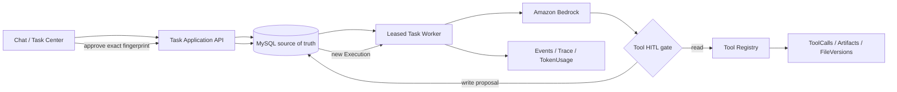

# AI Memory & Trace Platform

«Plataforma conversacional open source orientada a proyectos, diseñada para integrar modelos generativos, memoria persistente, RAG, herramientas, observabilidad y trazabilidad completa del proceso de respuesta.»

## Overview

AI Memory & Trace Platform es una aplicación de inteligencia artificial desarrollada para explorar una arquitectura de chat más persistente, observable y controlable que un flujo convencional de "prompt → modelo → respuesta".

El sistema incorpora múltiples capas de memoria, recuperación semántica, contexto de proyecto, herramientas de desarrollo, configuración dinámica de modelos y trazabilidad operacional por respuesta.

El objetivo principal es que una conversación con IA pueda mantener continuidad a largo plazo y que, al mismo tiempo, sea posible inspeccionar qué información utilizó el sistema, qué componentes participaron y cuánto costó producir una respuesta.

El proyecto está desarrollado principalmente con PHP, JavaScript y MySQL, e integra servicios de Amazon Web Services, incluyendo Amazon Bedrock y Amazon S3.

---

## Key Features

### Persistent Memory Architecture

El sistema implementa diferentes tipos de memoria con responsabilidades independientes:

- **Session Memory** — contexto y resúmenes asociados a una conversación.
- **Project Memory** — decisiones, reglas, hechos y notas persistentes de un proyecto.
- **Procedural Memory** — preferencias, correcciones, reglas y patrones de trabajo del usuario.
- **Selective Q&A Memory** — recuperación de preguntas y respuestas anteriores.
- **Primordial Context** — información marcada para conservarse como contexto prioritario.

La memoria se trata como una fuente estructurada de conocimiento y no simplemente como una extensión ilimitada del prompt.

---

### Memory Context Router

Antes de construir el contexto final, el sistema puede clasificar la intención de la consulta y determinar qué tipos de memoria son relevantes.

Ejemplos:

```
Preference request  → Procedural Memory
Previous decision   → Project Memory
Known fact          → Structured project context
Past conversation   → Semantic / Q&A memory
Project code        → RAG
```

Esto reduce recuperación innecesaria y permite controlar qué fuentes participan en cada respuesta.

---

### Context Builder & Ranking

Los candidatos recuperados desde memoria y RAG pasan por una etapa de construcción y selección de contexto.

El pipeline puede:

- recuperar candidatos;
- eliminar duplicados;
- clasificarlos;
- aplicar límites;
- priorizar resultados;
- respetar presupuestos de contexto;
- registrar elementos seleccionados y descartados.

El objetivo es enviar al modelo únicamente el contexto más útil para la pregunta actual.

---

### Retrieval-Augmented Generation

La plataforma incluye un sistema RAG para proyectos y archivos adjuntos.

El flujo general es:

```
Project / File
      ↓
Source extraction
      ↓
Chunks
      ↓
Embeddings
      ↓
Semantic retrieval
      ↓
Ranking
      ↓
Prompt context
```

Los fragmentos indexados conservan metadatos como:

- proyecto;
- archivo fuente;
- tipo de chunk;
- clase o función;
- líneas de inicio y fin;
- checksum;
- tokens;
- embedding utilizado.

---

### Dynamic AI Agents

Los componentes de IA pueden configurarse mediante agentes independientes.

Ejemplos:

- `chat_main`
- `prompt_compiler`
- `embedding_main`
- `smart_memory_general`
- `smart_memory_code`

Cada agente puede disponer de su propia configuración:

- modelo;
- temperatura;
- "top_p";
- límite de tokens;
- instrucciones del sistema;
- plantilla de usuario;
- fallback;
- configuración adicional;
- estado activo/inactivo.

Esto permite utilizar modelos diferentes para tareas diferentes sin acoplar la lógica de la aplicación a un único LLM.

---

### Prompt Compiler

El sistema puede incluir una fase previa para:

- corregir errores;
- mejorar claridad;
- enriquecer instrucciones;
- incorporar contexto relevante.

El compilador está diseñado para ser fault tolerant.

Si el proceso falla, excede el tiempo configurado o produce un resultado inválido, la conversación continúa utilizando la pregunta original del usuario.

```
User Prompt
    ↓
Prompt Compiler
    ├── Success → Optimized Prompt
    └── Failure → Original Prompt
```

Una función auxiliar nunca debe impedir la respuesta principal.

---

### Pipeline Feature Flags

Diferentes componentes del pipeline pueden habilitarse o deshabilitarse independientemente.

Entre ellos:

- Prompt Compiler
- Memory Router
- Procedural Memory
- Project Memory
- Session Memory
- Q&A Memory
- Project RAG
- Attachment RAG
- Context Ranking
- Memory Backfill
- Project Tools
- Memory Writer

Esto permite realizar pruebas controladas y comparar configuraciones sin eliminar información persistente.

---

### Memory Writer

Después de generar una respuesta, el sistema puede analizar la interacción y determinar si contiene información reutilizable.

El Memory Writer puede detectar y consolidar:

- decisiones;
- reglas;
- hechos;
- preferencias;
- correcciones;
- workflows;
- patrones.

Las operaciones de escritura de memoria quedan registradas para facilitar auditoría y debugging.

---

### Execution Traceability

Uno de los objetivos principales del proyecto es poder responder:

> «Why did the AI produce this answer?»

Cada respuesta puede asociarse con un "trace_id".

El sistema registra eventos operacionales relacionados con:

- Request
- Prompt Compiler
- Memory Router
- Feature Flags
- Context Retrieval
- Context Ranking
- Context Builder
- RAG
- Prompt Preparation
- Model Invocation
- Tool Calls
- Response
- Memory Writer
- Completion

La trazabilidad representa actividad operacional de la aplicación y no expone razonamiento privado del modelo.

---

### User → Project → Session → Q&A

La navegación de trazabilidad sigue la estructura:

```
User
  ↓
Project
  ↓
Session
  ↓
Question
  ↓
Answer
  ↓
Execution Trace
```

También se admiten conversaciones que no pertenecen a ningún proyecto.

---

### Execution Graph

Cada respuesta puede representarse como un grafo de ejecución.

```
Question
   ↓
Memory Router
   ↓
Context Builder
   ↓
Context Ranker
   ↓
Final Prompt
   ↓
Model
   ↓
Tools
   ↓
Response
   ↓
Memory Writer
```

El grafo permite inspeccionar individualmente los eventos y los datos registrados en cada fase.

---

### Memory & RAG Graph Integration

Los recursos de memoria utilizados durante una respuesta pueden representarse como nodos relacionados con el pipeline.

Ejemplo:

```
                    Context Builder
                   /       |        \
                  /        |         \
                 ↓         ↓          ↓

       ProjectContext   Procedural   SourceChunk
            #17          Memory #8      #94
                 \         |          /
                  \        |         /
                   └───────┼────────┘
                           ↓
                     Final Prompt
```

El sistema diferencia entre:

- recursos realmente utilizados;
- candidatos recuperados pero descartados;
- snapshot histórico;
- estado actual del registro.

---

### Historical vs Current State

La trazabilidad conserva el estado histórico utilizado durante una respuesta.

Ejemplo:

```
Historical value:
PHP 8.3

Current value:
PHP 8.4
```

Modificar una memoria posteriormente no altera retroactivamente el contexto que utilizó una respuesta anterior.

Esta separación permite mantener auditabilidad.

---

### Live Node Editing

Los registros de memoria actuales pueden administrarse desde el grafo.

Entre los recursos editables se encuentran:

- Project Context;
- Procedural Memory;
- Session Context Blocks;
- indexed Source Chunks;
- session summaries.

Las modificaciones afectan al estado actual, nunca al snapshot histórico del trace.

Cuando corresponde, los embeddings asociados se invalidan y se solicita su regeneración.

---

### 2D & 3D Visualization

La plataforma incluye visualización del grafo en dos modos.

#### 2D

Optimizada para inspección técnica y secuencia temporal.

#### 3D

La visualización tridimensional utiliza el espacio para representar dimensiones distintas del proceso.

- **X** → pipeline subsystem
- **Y** → execution sequence
- **Z** → knowledge provenance

El pipeline principal se mantiene en el plano central.

Los recursos utilizados y descartados pueden separarse espacialmente para facilitar la inspección.

---

### Tools & Project Operations

La plataforma incluye infraestructura para registrar operaciones ejecutadas sobre proyectos.

Ejemplos de herramientas:

- `grep`
- `search`
- `view`
- `read_chunk`
- `str_replace`
- `create_file`
- `write_file`
- `delete_file`
- `move_file`
- `lint`
- `run_tests`
- `preview_diff`
- `restore_version`

Las ejecuciones pueden almacenar:

- parámetros;
- archivo objetivo;
- resultado;
- estado;
- duración.

---

### File Versioning

Las modificaciones de archivos pueden asociarse con versiones.

El sistema contempla información como:

- project
- session
- message
- filename
- version
- S3 path
- diff summary
- status
- SHA-256 before
- SHA-256 after
- model used

Esto permite conservar trazabilidad de modificaciones relacionadas con operaciones de IA.

---

### Metrics, Tokens & Costs

La aplicación registra consumo asociado a diferentes fases del pipeline.

Ejemplos:

- compile
- respond
- embedding
- rag
- edit
- summarize
- review

Las métricas pueden incluir:

- input tokens;
- output tokens;
- modelo utilizado;
- duración;
- costo estimado;
- herramientas utilizadas;
- escrituras de memoria.

Los datos pueden analizarse por:

- Response
- Session
- Project
- User
- Month

Los costos mostrados son estimaciones y dependen de la configuración de precios aplicada por la instalación.

---

## AWS Integration

La implementación actual utiliza servicios de Amazon Web Services.

### Amazon Bedrock

Utilizado para:

- modelos conversacionales;
- modelos especializados;
- embeddings;
- generación de respuestas;
- tareas auxiliares de memoria.

### Amazon S3

Utilizado para almacenamiento de:

- archivos;
- adjuntos;
- contenido asociado a proyectos;
- versiones;
- recursos procesados por la aplicación.

### Amazon EC2

La plataforma puede desplegarse sobre infraestructura EC2 utilizando un stack PHP/MySQL convencional.

---

## Database Architecture

La aplicación utiliza una arquitectura relacional en MySQL.

Entre las entidades principales se encuentran:

- Users
- Projects
- ChatSessions
- ChatMessages
- ProjectContext
- UserProceduralMemory
- SessionContextBlocks
- ProjectSources
- SourceChunks
- ChunkEmbeddings
- EmbeddingJobs
- PromptCompilations
- MemoryWriteEvents
- ToolCalls
- FileVersions
- LintAttempts
- ChatActivityEvents
- TokenUsage

Las relaciones utilizan índices y claves foráneas para mantener aislamiento entre usuarios, proyectos, sesiones y recursos.

---

## Security Principles

El proyecto aplica diferentes mecanismos de seguridad según el componente:

- sesiones autenticadas;
- validación de propiedad de recursos;
- consultas preparadas;
- protección CSRF en operaciones de escritura;
- validación de scopes;
- aislamiento por usuario;
- separación de configuración y credenciales;
- control de acceso sobre proyectos y sesiones.

Las credenciales privadas no deben almacenarse en el repositorio.

---

## Planned Portable Architecture

Antes de considerar una distribución estable, el proyecto está evolucionando hacia una arquitectura portable y orientada a objetos.

Objetivos:

```
Environment configuration
        ↓
Single application bootstrap
        ↓
Composer / PSR-4
        ↓
Infrastructure abstractions
        ↓
Domain services
        ↓
Thin HTTP controllers
```

La instalación final deberá poder utilizar configuración externa para:

- Application URL
- Database
- AWS region
- AWS credentials / IAM role
- S3
- AI models
- Storage

sin modificar el código fuente.

---

## Roadmap

### Completed / Implemented

- [x] Persistent sessions
- [x] Project context
- [x] Procedural memory
- [x] Selective Q&A memory
- [x] Semantic embeddings
- [x] Project RAG
- [x] Attachment retrieval
- [x] Memory Context Router
- [x] Context Builder
- [x] Context Ranking
- [x] Memory Writer
- [x] Pipeline feature flags
- [x] Fault-tolerant Prompt Compiler
- [x] Operational tracing
- [x] Q&A trace explorer
- [x] Execution graph
- [x] Memory/RAG graph integration
- [x] Live memory node editing
- [x] 2D visualization
- [x] 3D visualization
- [x] Token and cost observability

### Planned

- [ ] Complete object-oriented refactor
- [ ] PSR-4 application structure
- [ ] Portable ".env" configuration
- [ ] Database migrations
- [ ] Installation wizard
- [ ] Provider abstraction
- [ ] Storage abstraction
- [ ] Automated regression tests
- [ ] Persistent task orchestrator
- [ ] Public stable release

---

## Task Orchestrator

The platform includes supervised and automatic persistent Tasks, validated multi-step plans, same-owner Task-to-Task dependencies, durable workers and an integrated Task Center.

The objective is to evolve from:

```
Ask
 ↓
Answer
```

toward:

```
Objective
   ↓
Task
   ↓
Plan
   ↓
Steps
   ↓
Dependencies
   ↓
Models / Tools
   ↓
Results
   ↓
Memory
   ↓
Trace
```

This allows workflows to preserve structured state independently from individual chat messages; human approval remains authoritative when automatic execution is disabled.



Write-capable tools pause durably and expose only a safe proposal. Approval is bound to the persisted fingerprint and consumed at most once by a new Execution. Task-level model, tool, write, token and duration limits are enforced server-side. Durable retry limits remain in MySQL.

Open `michat/task_center.php` to inspect owned Tasks, Steps, pending approvals, errors, artifacts and traces; cancel or retry eligible Tasks; and approve or reject the correct HITL contract without sending internal IDs.

---

## Requirements

The current implementation is based on approximately:

- PHP 8.1 or newer
- MySQL 8.0 or newer (JSON, generated columns and `SKIP LOCKED` are used)
- JavaScript
- Composer
- AWS SDK for PHP
- Amazon Bedrock access
- Amazon S3

- PHP extensions: `mysqli`, `json`, `mbstring`, `curl`, `openssl` and `fileinfo`
- A web server capable of serving PHP (Apache or nginx with PHP-FPM)

---

## Installation

```bash
git clone https://github.com/jimmybackend/michat.git
cd michat

composer install --no-dev --prefer-dist --optimize-autoloader

cp .env.example .env
mysql -u root -p -e 'CREATE DATABASE michat CHARACTER SET utf8mb4 COLLATE utf8mb4_0900_ai_ci'
mysql -u root -p michat < adbbmis1_Cloud.sql
```

Configure your environment:

```env
DB_HOST=localhost
DB_PORT=3306
DB_NAME=
DB_USER=
DB_PASSWORD=

AWS_REGION=
AWS_ACCESS_KEY_ID=
AWS_SECRET_ACCESS_KEY=
AWS_SESSION_TOKEN=
AWS_S3_BUCKET=
MICHAT_MAINTENANCE_SECRET=
```

For AWS environments, IAM roles should be preferred over long-lived credentials whenever possible.

Grant the runtime identity only the Bedrock model invocation and S3 bucket/object actions required by the configured agents and bucket. Do not grant blanket administrator access. The S3 bucket must remain private.

Point the web-server document root at the repository directory (or map `/michat` explicitly), deny access to `.env`, and allow the PHP user to write only application upload/cache locations used by your deployment. Never make the source tree world-writable.

Run a smoke test and the complete isolated test suite:

```bash
php michat/tests/task_api_test.php
for test in michat/tests/*_test.php; do php "$test"; done
```

Database integration tests use the optional `TASK_TEST_DB_*` variables and explicitly report `SKIP` when they are absent.

### Worker

Run one job while validating an installation:

```bash
php michat/bin/task_worker.php --once
```

For production, supervise the durable loop with systemd or Supervisor rather than cron:

```ini
[Service]
WorkingDirectory=/var/www/michat
ExecStart=/usr/bin/php michat/bin/task_worker.php --loop
Restart=always
User=www-data
EnvironmentFile=/var/www/michat/.env
```

Use a unique `TASK_WORKER_ID` per process. Lease expiry and recovery are handled by the worker; do not run overlapping cron invocations with the same worker identity.

---

## Architecture Philosophy

The project follows several design principles.

### Memory is not the prompt

Persistent knowledge should be stored independently and retrieved only when relevant.

### Retrieval should be selective

Semantic similarity alone is not always sufficient. Intent, scope, memory type and ranking should participate in context selection.

### Auxiliary AI must fail safely

Failure of a compiler, memory operation or retrieval subsystem should not unnecessarily prevent the main conversation from continuing.

### Historical traces are immutable

The system should distinguish:

> What the AI used then

from:

> What the database contains now

### Observability is part of the architecture

A production AI application should make it possible to inspect:

- what happened
- what information was selected
- what model was called
- what tools were executed
- how long it took
- how much it cost

---

## Project Status

This project is release-ready for controlled public deployments and remains under active development.

Review model access, IAM permissions, database backups and worker supervision before exposing a deployment to users. External AWS/MySQL E2E validation is environment-specific.

---

## Contributing

Contributions, discussions and technical feedback are welcome.

Before submitting significant changes, consider opening an issue describing:

- the problem;
- the proposed architecture;
- compatibility implications;
- database changes;
- security considerations.

Contribution guidelines will be expanded as the project approaches its first stable release.

---

## Security

Do not publish:

- AWS access keys;
- database passwords;
- production ".env" files;
- S3 secrets;
- private user information;
- production database dumps.

Security issues should not be disclosed publicly before maintainers have had an opportunity to review them.

A dedicated "SECURITY.md" is recommended for the public repository.

---

## License

This project is released under the MIT License.

You may use, modify, distribute and incorporate the software into other projects subject to the terms of the MIT License.

Third-party libraries and external services retain their respective licenses and terms of use.

See:

- LICENSE

for the complete license text.

---

## Disclaimer

This software is provided as an open source project for development, experimentation and integration of AI-assisted systems.

Model outputs may be inaccurate.

Users and deployers are responsible for validating generated content, securing credentials, configuring permissions and reviewing AI-generated modifications before using the software in production.
