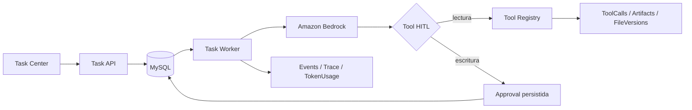

# MiChat — AI Memory, RAG, Tasks & Multimodal Platform

MiChat es una plataforma conversacional open source orientada a proyectos que integra memoria persistente, RAG, agentes configurables, herramientas, trazabilidad, Tasks durables y capacidades multimodales sobre Amazon Web Services.

El objetivo no es limitarse al flujo `prompt -> modelo -> respuesta`, sino mantener conocimiento reutilizable, seleccionar contexto de forma controlada, ejecutar trabajo persistente fuera del navegador y hacer observable qué componentes participaron en cada interacción.

El proyecto está desarrollado principalmente con PHP 8.x, JavaScript y MySQL 8, con Amazon Bedrock y Amazon S3 como infraestructura principal de IA y almacenamiento.

## Estado actual

A septiembre de 2026, `main` contiene y mantiene operativas estas áreas principales:

- chat conversacional separado de la superficie de Tasks;
- memoria de sesión, proyecto, procedimientos, preguntas/respuestas y contexto primordial;
- RAG de proyecto y RAG de adjuntos;
- preparación automática de documentos adjuntos para embeddings y recuperación semántica;
- análisis visual de imágenes adjuntas y reutilización posterior mediante el mismo RAG;
- generación de imágenes con modelos Amazon;
- voz turn-based con Amazon Nova 2 Sonic;
- generación de video asíncrona con Amazon Nova Reel;
- Task Orchestrator persistente con Worker, planificación, scheduling, recurrencia, HITL, herramientas y autonomía acotada;
- trazabilidad, grafos, TokenUsage y observabilidad operacional.

La referencia corta para continuar desarrollo y despliegue está en `michat/doc/contexto-operativo-actual.md`. Los documentos históricos de fases se conservan como evidencia de evolución y no sustituyen el código real de `main`.

## Arquitectura de conversación y memoria

MiChat mantiene diferentes fuentes de conocimiento con responsabilidades separadas:

- **Session Memory**: contexto y resúmenes de una conversación.
- **Project Memory**: decisiones, reglas, hechos y notas persistentes de un proyecto.
- **Procedural Memory**: preferencias, correcciones, patrones y reglas de trabajo.
- **Selective Q&A Memory**: recuperación de preguntas y respuestas previas.
- **Primordial Context**: información marcada como prioritaria.
- **Project RAG**: recuperación semántica sobre fuentes indexadas del proyecto.
- **Attachment RAG**: recuperación semántica sobre documentos e imágenes adjuntos a una sesión.

El principio central es que **la memoria no es el prompt**. El contenido persistente se guarda por separado y solo se recupera cuando es relevante.

```text
Pregunta
  ↓
Memory Context Router
  ↓
Recuperación de candidatos
  ↓
Context Builder + Ranking
  ↓
RAG / memoria seleccionada
  ↓
Prompt final
  ↓
Amazon Bedrock
  ↓
Respuesta
  ↓
Memory Writer + Trace + TokenUsage
```

## Adjuntos y RAG automático

Al subir un documento a una conversación, MiChat no lo deja únicamente en S3. El pipeline automático puede:

1. registrar el archivo en S3/FileS3;
2. extraer texto;
3. crear bloques `file_chunk`;
4. generar embeddings con `embedding_main`;
5. producir un resumen semántico `block_type='file'`;
6. vectorizar el resumen;
7. dejar el contenido disponible para el RAG de adjuntos.

Los botones manuales **Indexar** y **Semántica** reutilizan el mismo servicio y funcionan como reintentos explícitos. Si Bedrock no puede vectorizar en ese momento, `EmbeddingJobs` conserva el trabajo pendiente para mantenimiento posterior.

Entre los formatos manejados por el extractor se encuentran código y texto como PHP, JS, HTML, JSON, SQL, TXT, MD, CSV, Python, XML, YAML y logs, además de documentos como PDF, DOCX, XLSX, PPTX, ODT/ODS/ODP, RTF, EPUB y formatos Office antiguos cuando los conversores requeridos están disponibles.

Más detalle: `michat/doc/attachment-knowledge-pipeline.md`.

## Visión de imágenes adjuntas

Las imágenes JPG/JPEG, PNG, WEBP y GIF pueden convertirse en conocimiento textual reutilizable.

`SessionImageKnowledgeService` valida ownership y límites, obtiene la imagen desde S3 y usa Bedrock Converse para extraer descripción visual, texto visible y contenido útil como tablas, código, errores, diagramas, objetos y estructura. El resultado se persiste como `SessionContextBlocks.block_type='file'` con metadata `type='visual_summary'`, se vectoriza con `embedding_main` y queda disponible para el RAG existente.

No se creó un retriever paralelo ni una tabla especial para imágenes. Las preguntas posteriores recuperan el resumen visual relevante en lugar de reenviar los bytes de la imagen en cada turno.

El agente `attachment_vision` se configura desde **Preferencias -> Modelos IA**. Los modelos visuales Amazon disponibles en este flujo son Nova Lite, Nova Pro y Nova Premier. Nova Micro es texto-only y Nova Canvas es un generador de imágenes, no un modelo de comprensión visual.

Más detalle: `michat/doc/attachment-image-vision-rag.md`.

## Capacidades multimodales Amazon

Por ahora, MiChat mantiene las capacidades generativas de chat, visión, imagen, voz y video dentro de Amazon/AWS.

### Generación de imágenes — `image_main`

- **Amazon Titan Image Generator v2**: modelo predeterminado más durable.
- **Amazon Nova Canvas**: opción Legacy mientras permanezca disponible.
- generación inicial cerrada a 1024x1024;
- modelo resuelto server-side desde `UserAIAgentConfigs`;
- salida PNG privada en S3;
- resultado persistido en `ChatMessages` como `content_type='image'`;
- el cliente no puede seleccionar arbitrariamente otro modelo.

### Visión de adjuntos — `attachment_vision`

- Amazon Nova Lite;
- Amazon Nova Pro;
- Amazon Nova Premier;
- activación y modelo configurables por usuario;
- fallback seguro a Nova Lite cuando no existe una configuración visual efectiva.

### Voz — `voice_main`

- modelo: `amazon.nova-2-sonic-v1:0`;
- voces españolas: **Lupe** y **Carlos**;
- modo inicial push-to-talk / turn-based;
- captura del micrófono desde navegador HTTPS;
- audio de entrada convertido a LPCM 16 kHz / 16-bit;
- bridge Node.js con `InvokeModelWithBidirectionalStreamCommand`;
- respuesta de audio LPCM 24 kHz;
- transcripciones finales de usuario y asistente persistidas en `ChatMessages`;
- consumo real del turno registrado en `TokenUsage`.

La voz requiere Node.js 20+ y las dependencias de `michat/voice/package.json`.

### Video — `video_main`

- Amazon Nova Reel 1.1 como opción principal cuando la región es compatible;
- Amazon Nova Reel 1.0 como fallback regional soportado;
- `StartAsyncInvoke` / `GetAsyncInvoke` de Bedrock;
- tarea `TEXT_VIDEO`;
- clip simple actual: 6 segundos, 1280x720, 24 fps;
- salida `output.mp4` escrita por Bedrock en S3 privado;
- polling web hasta completar el trabajo;
- resultado final persistido en el historial del chat.

Nova Reel está aislado detrás de `video_main` porque AWS lo clasifica como Legacy y ha anunciado fin de vida para el 30 de septiembre de 2026. El aislamiento permite sustituir el generador en el futuro sin rehacer la UI ni el contrato del chat.

Resumen técnico: `michat/doc/multimodal-media-aws.md`.

## Agentes y configuración dinámica

La configuración efectiva de IA utiliza un catálogo GLOBAL más overrides USER. El runtime central resuelve la configuración efectiva por `agent_key` y el override del usuario tiene prioridad sobre el registro GLOBAL.

Entre las claves actuales se encuentran:

- `chat_main`
- `prompt_compiler`
- `embedding_main`
- `smart_memory_general`
- `smart_memory_code`
- `attachment_vision`
- `image_main`
- `voice_main`
- `video_main`
- `task_planner`
- `next_work_evaluator`

Cada agente puede administrar, según el modelo y el flujo, parámetros como modelo, activación, instrucciones, plantilla, temperatura, `top_p`, límites de tokens y configuración adicional.

## Chat y Tasks son superficies diferentes

Una regla de producto importante es que una pregunta normal del chat **no debe crear automáticamente una Task**.

- `michat/chat.php`: conversación normal.
- `michat/task_center.php`: trabajo explícito, persistente y orquestado.
- `michat/task_api.php`: API de operaciones del dominio Task.
- `michat/bin/task_worker.php`: Worker CLI persistente.

La configuración `task_*` sigue disponible para Task Center y Worker, pero el snapshot usado por el chat normal enmascara esas flags para evitar que una pregunta conversacional termine inesperadamente en aprobación de agente.

La reanudación de una Task ya creada y aprobada sigue disponible mediante la acción explícita correspondiente y conserva ownership y contexto persistido.

Más detalle: `michat/doc/chat-task-boundary.md`.

## Task Orchestrator

MiChat incluye un sistema persistente de Tasks que evolucionó durante las fases 8 a 11.

Capacidades implementadas:

- creación manual de Tasks;
- modos supervised y automatic;
- planificación mediante `task_planner`;
- Steps tipados y ejecución POO compartida;
- Worker durable con leases, heartbeat y recovery;
- ejecución síncrona y asíncrona;
- scheduling UTC one-shot;
- reprogramación;
- recurrencia daily/weekly con timezone IANA y políticas de misfire;
- dependencias Task-to-Task;
- historial y eventos;
- artifacts y FileVersions;
- retry controlado;
- cancelación cooperativa;
- herramientas `grep`, `search`, `view`, `str_replace` y `code_edit`;
- HITL para escrituras con fingerprint persistido y consumo one-shot;
- Task Center con Lista/Tablero, detalle, filtros, historial, artifacts y acciones;
- refresco automático cada 5 segundos mientras hay trabajo no terminal;
- autonomía acotada por proyecto, budgets, ciclos, NextWork, Proposals y replanning versionado.

El Worker y HTTP comparten la misma frontera de ejecución; el Worker no llama endpoints HTTP internos para ejecutar Steps.



## Observabilidad y trazabilidad

Cada respuesta o ejecución puede registrar actividad operacional como:

- request;
- compilación de prompt;
- Memory Router;
- recuperación de contexto;
- ranking;
- RAG;
- modelo efectivo;
- Tool Calls;
- respuesta;
- Memory Writer;
- eventos de Task;
- tokens, duración y costo estimado.

Los grafos 2D/3D distinguen el snapshot histórico usado en una respuesta del estado actual de memoria o fuentes. La trazabilidad representa actividad observable de la aplicación; no pretende exponer razonamiento privado interno del modelo.

## Base de datos

MiChat usa MySQL como fuente de verdad transaccional. Entre las entidades importantes se encuentran:

- `Users`
- `Projects`
- `ChatSessions`
- `ChatMessages`
- `ProjectContext`
- `UserProceduralMemory`
- `SessionContextBlocks`
- `ProjectSources`
- `SourceChunks`
- `ChunkEmbeddings`
- `EmbeddingJobs`
- `MemoryWriteEvents`
- `ToolCalls`
- `FileVersions`
- `ChatActivityEvents`
- `TokenUsage`
- `Tasks`
- `TaskSteps`
- `TaskExecutions`
- `TaskEvents`
- `TaskArtifacts`
- `TaskDependencies`
- `TaskRecurrenceRules`
- `TaskRecurrenceOccurrences`
- tablas de autonomía y replanning de Fase 11.

El dump canónico de instalación limpia es `adbbmis1_Cloud.sql`. El esquema soportado se versiona mediante el catálogo de migraciones y la instalación limpia registra el baseline `current-dump`.

Los bloques funcionales recientes de adjuntos, visión, imagen, voz y video no requieren nuevas migraciones SQL.

## Seguridad

Principios aplicados en el runtime actual:

- identidad autenticada resuelta server-side;
- ownership de proyecto, sesión, mensaje y archivos;
- `user_id` de request tratado como assertion y no como autenticación;
- consultas preparadas;
- CSRF en mutaciones web;
- configuración GLOBAL administrada mediante permisos DB-backed;
- sin privilegios mágicos por `user_id=1`;
- S3 privado;
- credenciales fuera del repositorio;
- Tools de escritura sujetas a políticas y HITL en Tasks;
- operaciones destructivas de mantenimiento protegidas y fail-closed.

Nunca publiques `.env`, credenciales AWS/DB, dumps de producción ni datos privados de usuarios.

## Requisitos

- PHP 8.1+; el proyecto se desarrolla para PHP 8.x.
- MySQL 8.0.16+.
- Composer 2.
- extensiones PHP `mysqli`, `mbstring`, `curl`, `openssl`, `fileinfo` y JSON.
- servidor web Apache o nginx + PHP-FPM.
- acceso a Amazon Bedrock.
- bucket Amazon S3 privado.
- Node.js 20+ solo si se habilita `voice_main` / Nova 2 Sonic.

## Instalación base

```bash
git clone https://github.com/jimmybackend/michat.git
cd michat

cp .env.example .env
composer install --no-dev --prefer-dist --optimize-autoloader

DB_NAME=michat
mysql -u root -p -e "CREATE DATABASE \`${DB_NAME}\` CHARACTER SET utf8mb4 COLLATE utf8mb4_0900_ai_ci"
mysql -u root -p "$DB_NAME" < adbbmis1_Cloud.sql
php michat/bin/migrations.php baseline --profile=current-dump
```

Configure el entorno efectivo con DB y AWS. `.env` es opcional: en producción se puede inyectar configuración mediante Apache/PHP-FPM y systemd.

Variables principales:

```env
DB_HOST=127.0.0.1
DB_PORT=3306
DB_NAME=michat
DB_USER=michat_user
DB_PASSWORD=

AWS_REGION=us-east-1
AWS_DEFAULT_REGION=
AWS_S3_BUCKET=
AWS_ACCESS_KEY_ID=
AWS_SECRET_ACCESS_KEY=
AWS_SESSION_TOKEN=

MICHAT_MAINTENANCE_SECRET=
TASK_WORKER_ID=
TASK_WORKER_LEASE_SECONDS=300
TASK_WORKER_SLEEP_SECONDS=2
TASK_WORKER_RECOVERY_BATCH=50
```

En EC2 se recomienda IAM Role en lugar de claves AWS de larga duración.

### Voz Nova 2 Sonic

Si se habilitará `voice_main`:

```bash
cd michat/voice
npm install --omit=dev
```

`voice_turn.php` busca Node en `MICHAT_NODE_BINARY`, `/usr/bin/node` o `/usr/local/bin/node`.

## Layout EC2 usado actualmente

La instalación de desarrollo validada utiliza:

```text
/var/www/michat                         repositorio
/etc/michat.env                         entorno privado compartido
/var/www/michat/michat/bin/task_worker.php
```

El archivo `/etc/michat.env` debe ser legible por el usuario del Worker; en la instalación actual se usa `root:apache` con modo `0640`.

No se deben destruir automáticamente cambios locales de una instalación existente. Antes de `reset`, `clean` o cualquier operación destructiva, revisar `git status`.

### Worker systemd

Ejemplo correspondiente al layout actual:

```ini
[Unit]
Description=MiChat Task Worker
After=network.target
Wants=network.target

[Service]
Type=simple
User=apache
Group=apache
WorkingDirectory=/var/www/michat
EnvironmentFile=/etc/michat.env
ExecStart=/usr/bin/php /var/www/michat/michat/bin/task_worker.php --loop
Restart=always
RestartSec=2

[Install]
WantedBy=multi-user.target
```

Comprobación:

```bash
sudo systemctl is-enabled michat-task-worker.service
sudo systemctl is-active michat-task-worker.service
ps aux | grep '[t]ask_worker.php'
```

## Pruebas

El repositorio contiene pruebas PHP y contratos JavaScript. GitHub Actions ejecuta sintaxis, contratos críticos, regresión PHP, contratos JavaScript y guardas de secretos/backups.

Prueba general local:

```bash
for test in michat/tests/*_test.php; do php "$test"; done
```

Los E2E de MySQL aislado requieren `TASK_TEST_DB_*`. Cuando esas variables no existen, los tests correspondientes deben reportarse como `SKIP`; un `SKIP` no equivale a certificación MySQL real.

Entre los contratos recientes se encuentran:

- `session_attachment_auto_knowledge_test.php`
- `session_attachment_image_vision_test.php`
- `attachment_vision_preferences_test.php`
- `voice_audio_contract_test.php`
- `image_generation_contract_test.php`
- `video_generation_contract_test.php`
- `task_planner_executable_contract_test.php`
- `task_center_live_refresh_test.php`

## Roadmap por fases

- **Fase 8 — cerrada:** Task Orchestrator persistente y ejecución compartida.
- **Fase 9 — cerrada:** Task Center 2.0, navegación, tablero, dependencias, historial y hardening UI.
- **Fase 10 — cerrada:** scheduling, Tasks manuales ejecutables, recurrencia y administración de recurrencias.
- **Fase 11 — cerrada:** autonomía operacional acotada, NextWork, Proposals, budgets, continuaciones y replanning.
- **Fase 12 — hardening/release:** seguridad HTTP, migraciones, compatibilidad MySQL, configuración GLOBAL/USER, roles, provisioning, retry/heartbeat y preparación para despliegues controlados.
- **Bloque multimodal posterior:** adjuntos automáticos, visión, voz, generación de imágenes y video Amazon integrados sin romper la frontera Chat/Tasks.

Para el estado operativo más reciente usar `michat/doc/contexto-operativo-actual.md` y verificar siempre el HEAD real de `main`.

## Documentación

- `michat/doc/README.md` — índice de documentación actual e histórica.
- `michat/doc/contexto-operativo-actual.md` — referencia corta para continuar desarrollo/despliegue.
- `docs/CHAT.md` — arquitectura actual de conversación.
- `docs/TASK.md` — arquitectura actual de Tasks y Worker.
- `michat/doc/chat-task-boundary.md` — frontera Chat/Task.
- `michat/doc/attachment-knowledge-pipeline.md` — documentos adjuntos y RAG.
- `michat/doc/attachment-image-vision-rag.md` — visión de imágenes adjuntas.
- `michat/doc/multimodal-media-aws.md` — imagen, visión, voz y video Amazon.
- `michat/doc/fase12b-closure-audit.md` — evidencia de cierre/hardening de Fase 12B.

## Licencia

MIT License. Consulta `LICENSE`.

## Disclaimer

MiChat es software open source para desarrollo, experimentación e integración de sistemas asistidos por IA. Los modelos pueden producir resultados incorrectos. Cada despliegue es responsable de validar contenido generado, asegurar credenciales, configurar IAM/S3/DB correctamente y revisar cambios producidos por IA antes de utilizarlos en producción.
